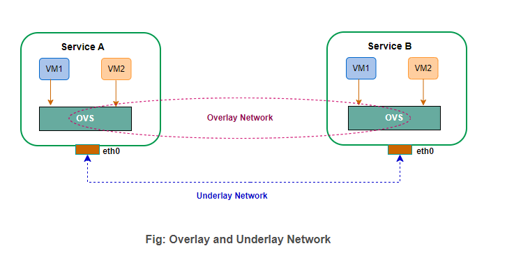
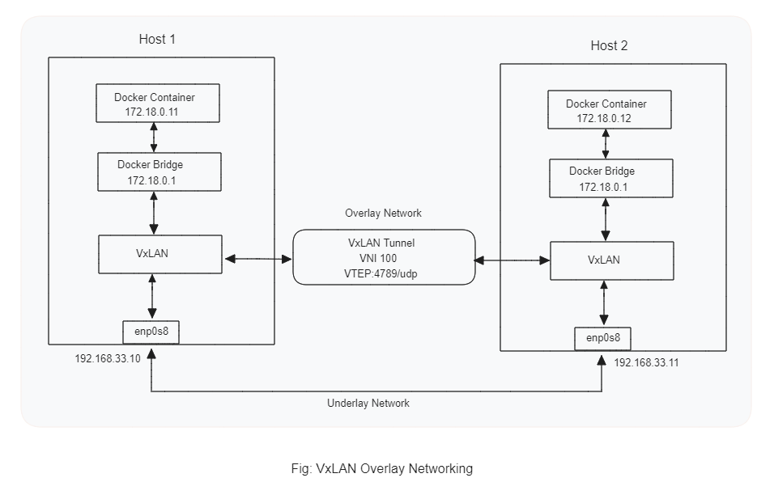

## VxLAN Overlay Networks: Multi-Container Host Networking

### Description

Explore the world of overlay networks with this hands-on. Gain practical insights into enabling seamless communication between containers within a multi-container environment using Docker. Follow our step-by-step guide to set up Docker bridge networks and establish connections using VxLAN Overlay Networks. Unleash the power of network virtualization and optimize your containerized applications with eas

### What is Overlay Network and Underlay Network ?

- `Underlay Network:` The underlay network is the physical or basic network infrastructure that provides the foundation for communication between devices. It comprises the actual physical links (such as copper wires, fiber optics, or wireless connections) that transmit data packets between routers, switches, and other networking devices. The underlay network is responsible for routing and forwarding data packets efficiently across the network based on IP addresses and other networking protocols.

- `Overlay Network:` An overlay network, on the other hand, is a virtual or logical network that is built on top of the underlying underlay network. It is created to facilitate specific functionalities, services, or applications. Overlay networks are typically software-defined and use tunneling or encapsulation techniques to transmit data packets over the underlay network.

<figure > 
<p align="center">
  
</p>
</figure>

### What is VxLAN?

VXLAN, which stands for Virtual Extensible LAN, is a network virtualization technology used to create overlay networks. It is designed to enable the creation of large-scale virtual LANs (VLANs) that can span across data centers or cloud environments while abstracting the underlying physical network infrastructure.

### Hands-on Overview Diagram:

<figure > 
<p align="center">
  
</p>
</figure>

### Hands-on:

#### Step-0: Environment Setup:

- To carry out this implementation, you can deploy two virtual machines (VMs) on platforms such as VirtualBox, a hypervisor, or an EC2 instance with Ubuntu. It’s essential to ensure that both VMs are on the same network to enable seamless communication between the hosts.

- In this tutorial, we will use Vagrant to run two VM hosts locally on VirtualBox, assigning the IP address 192.168.33.10 to Host 1 and 192.168.33.11 to Host 2. After the initial setup, follow the steps below to demonstrate the power of VxLAN Overlay Networks in connecting and optimizing container communication within this multi-container host networking environment.

#### Step 1: Docker Client Installation & Bridge Creation:

To install docker client and to create separate subnet using docker network utility.

> For Host-1:

```bash
# update the repository and install docker
sudo apt update
sudo apt install -y docker.io

# create a separate docker bridge network
sudo docker network create --subnet 172.18.0.0/16 vxlan-net

# command output like
b62142a139b5b46095454d58cd24dea8fdbc3ab7112590e4d2ec17d0b03b9484

# list all networks in docker
sudo docker network ls

# command output like
NETWORK ID     NAME        DRIVER    SCOPE
d7299c549f42   bridge      bridge    local
03f769f8992f   host        host      local
d0a7f09af756   none        null      local
b62142a139b5   vxlan-net   bridge    local

# Check interfaces
ip a

# command output like
1: lo: <LOOPBACK,UP,LOWER_UP> mtu 65536 qdisc noqueue state UNKNOWN group default qlen 1000
    link/loopback 00:00:00:00:00:00 brd 00:00:00:00:00:00
    inet 127.0.0.1/8 scope host lo
       valid_lft forever preferred_lft forever
    inet6 ::1/128 scope host
       valid_lft forever preferred_lft forever
2: enp0s3: <BROADCAST,MULTICAST,UP,LOWER_UP> mtu 1500 qdisc fq_codel state UP group default qlen 1000
    link/ether 02:3b:7b:b7:3b:2d brd ff:ff:ff:ff:ff:ff
    inet 10.0.2.15/24 brd 10.0.2.255 scope global dynamic enp0s3
       valid_lft 85595sec preferred_lft 85595sec
    inet6 fe80::3b:7bff:feb7:3b2d/64 scope link
       valid_lft forever preferred_lft forever
3: enp0s8: <BROADCAST,MULTICAST,UP,LOWER_UP> mtu 1500 qdisc fq_codel state UP group default qlen 1000
    link/ether 08:00:27:7c:e6:8f brd ff:ff:ff:ff:ff:ff
    inet 192.168.33.10/24 brd 192.168.33.255 scope global enp0s8
       valid_lft forever preferred_lft forever
    inet6 fe80::a00:27ff:fe7c:e68f/64 scope link
       valid_lft forever preferred_lft forever
4: docker0: <NO-CARRIER,BROADCAST,MULTICAST,UP> mtu 1500 qdisc noqueue state DOWN group default
    link/ether 02:42:c8:8b:d6:0d brd ff:ff:ff:ff:ff:ff
    inet 172.17.0.1/16 brd 172.17.255.255 scope global docker0
       valid_lft forever preferred_lft forever
5: br-b62142a139b5: <NO-CARRIER,BROADCAST,MULTICAST,UP> mtu 1500 qdisc noqueue state DOWN group default
    link/ether 02:42:0e:8a:3e:47 brd ff:ff:ff:ff:ff:ff
    inet 172.18.0.1/16 brd 172.18.255.255 scope global br-b62142a139b5
       valid_lft forever preferred_lft forever
```

> For Host-2:

```bash
# update the repository and install docker
sudo apt update
sudo apt install -y docker.io

# create a separate docker bridge network
sudo docker network create --subnet 172.18.0.0/16 vxlan-net

# command output like
c66b5760daee633e39fb64f9108e95ce56da61d219ef5e938a6fbed3cecd1eb6

# list all networks in docker
sudo docker network ls

# command output like
NETWORK ID     NAME        DRIVER    SCOPE
8e49e6bba30d   bridge      bridge    local
67ee64fa0a81   host        host      local
5125eafc1988   none        null      local
c66b5760daee   vxlan-net   bridge    local

# Check interfaces
ip a

# command output like
1: lo: <LOOPBACK,UP,LOWER_UP> mtu 65536 qdisc noqueue state UNKNOWN group default qlen 1000
    link/loopback 00:00:00:00:00:00 brd 00:00:00:00:00:00
    inet 127.0.0.1/8 scope host lo
       valid_lft forever preferred_lft forever
    inet6 ::1/128 scope host
       valid_lft forever preferred_lft forever
2: enp0s3: <BROADCAST,MULTICAST,UP,LOWER_UP> mtu 1500 qdisc fq_codel state UP group default qlen 1000
    link/ether 02:3b:7b:b7:3b:2d brd ff:ff:ff:ff:ff:ff
    inet 10.0.2.15/24 brd 10.0.2.255 scope global dynamic enp0s3
       valid_lft 85593sec preferred_lft 85593sec
    inet6 fe80::3b:7bff:feb7:3b2d/64 scope link
       valid_lft forever preferred_lft forever
3: enp0s8: <BROADCAST,MULTICAST,UP,LOWER_UP> mtu 1500 qdisc fq_codel state UP group default qlen 1000
    link/ether 08:00:27:08:71:fb brd ff:ff:ff:ff:ff:ff
    inet 192.168.33.11/24 brd 192.168.33.255 scope global enp0s8
       valid_lft forever preferred_lft forever
    inet6 fe80::a00:27ff:fe08:71fb/64 scope link
       valid_lft forever preferred_lft forever
4: docker0: <NO-CARRIER,BROADCAST,MULTICAST,UP> mtu 1500 qdisc noqueue state DOWN group default
    link/ether 02:42:8d:ab:5b:d8 brd ff:ff:ff:ff:ff:ff
    inet 172.17.0.1/16 brd 172.17.255.255 scope global docker0
       valid_lft forever preferred_lft forever
5: br-c66b5760daee: <NO-CARRIER,BROADCAST,MULTICAST,UP> mtu 1500 qdisc noqueue state DOWN group default
    link/ether 02:42:27:5f:a9:de brd ff:ff:ff:ff:ff:ff
    inet 172.18.0.1/16 brd 172.18.255.255 scope global br-c66b5760daee
       valid_lft forever preferred_lft forever
```

#### Step 2: Run Docker Container:

Run the Docker containers on the newly established Docker bridge network.

> For Host-1:

```bash
# running ubuntu container with "sleep 3000" and a static ip
sudo docker run -d --net vxlan-net --ip 172.18.0.11 ubuntu sleep 3000

# check the container running or not
sudo docker ps

# command output like
CONTAINER ID   IMAGE     COMMAND        CREATED          STATUS          PORTS     NAMES
5cb2f75e87ea   ubuntu    "sleep 3000"   44 seconds ago   Up 6 seconds             thirsty_robinson

# check the IPAddress to make sure that the ip assigned properly
sudo docker inspect 5cb2f75e87ea | grep IPAddress

# command output like
            "SecondaryIPAddresses": null,
            "IPAddress": "",
                    "IPAddress": "172.18.0.11",

# ping the docker bridge ip to see whether the traffic can pass
ping 172.18.0.1 -c 2

# command output like
PING 172.18.0.1 (172.18.0.1) 56(84) bytes of data.
64 bytes from 172.18.0.1: icmp_seq=1 ttl=64 time=0.027 ms
64 bytes from 172.18.0.1: icmp_seq=2 ttl=64 time=0.044 ms

--- 172.18.0.1 ping statistics ---
2 packets transmitted, 2 received, 0% packet loss, time 999ms
rtt min/avg/max/mdev = 0.027/0.035/0.044/0.010 ms
```

> For Host-2:

```bash
# running ubuntu container with "sleep 3000" and a static ip
sudo docker run -d --net vxlan-net --ip 172.18.0.12 ubuntu sleep 3000

# check the container running or not
sudo docker ps

# command output like
CONTAINER ID   IMAGE     COMMAND        CREATED          STATUS          PORTS     NAMES
f5d972624f7f   ubuntu    "sleep 3000"   44 seconds ago   Up 6 seconds             thirsty_robinson

# check the IPAddress to make sure that the ip assigned properly
sudo docker inspect f5d972624f7f | grep IPAddress

# command output like
            "SecondaryIPAddresses": null,
            "IPAddress": "",
                    "IPAddress": "172.18.0.12",

# ping the docker bridge ip to see whether the traffic can pass
ping 172.18.0.1 -c 2

# command output like
PING 172.18.0.1 (172.18.0.1) 56(84) bytes of data.
64 bytes from 172.18.0.1: icmp_seq=1 ttl=64 time=0.036 ms
64 bytes from 172.18.0.1: icmp_seq=2 ttl=64 time=0.099 ms

--- 172.18.0.1 ping statistics ---
2 packets transmitted, 2 received, 0% packet loss, time 1019ms
rtt min/avg/max/mdev = 0.036/0.067/0.099/0.032 ms

```

#### Step 3: Access to the Running Docker Container:

Access the running container and attempt to ping another container running on a different host using their respective IP addresses. Although container communication will fail since there is no tunnel or mechanism to carry the traffic between them.

> For Host-1:

```bash
# enter the running container using exec
sudo docker exec -it 5cb2f75e87ea bash

# # inside container
# update the package and install net-tools and ping tools
apt-get update
apt-get install net-tools
apt-get install iputils-ping

# Now ping the another container
ping 172.18.0.12 -c 2

# command output like
PING 172.18.0.12 (172.18.0.12) 56(84) bytes of data.
--- 172.18.0.12 ping statistics ---
2 packets transmitted, 0 received, 100% packet loss, time 2028ms

# exit to come out from container
exit

```

> For Host-2:

```bash
# enter the running container using exec
sudo docker exec -it f5d972624f7f bash

# inside container
apt-get update
apt-get install net-tools
apt-get install iputils-ping

# Now ping the another container
ping 172.18.0.11 -c 2

# command output like
PING 172.18.0.11 (172.18.0.11) 56(84) bytes of data.
--- 172.18.0.11 ping statistics ---
2 packets transmitted, 0 received, 100% packet loss, time 2028ms

# exit to come out from container
exit
```

#### Step 4: Create a VxLAN tunnel to Communicate Between Two Hosts:

We will then attach the VxLAN to the Docker bridge, ensuring that both hosts have the same VNI ID for seamless integration.

> For Host-1:

```bash
# check the bridges list on the hosts
brctl show

# command output like
bridge name     bridge id               STP enabled     interfaces
br-b62142a139b5         8000.02420e8a3e47       no              veth5aca1ef
docker0         8000.0242c88bd60d       no

# create a vxlan
# 'vxlan-demo' is the name of the interface, type should be vxlan
# VNI ID is 100
# dstport should be 4789 which a udp standard port for vxlan communication
# 192.168.33.11 is the ip of another host
sudo ip link add vxlan-demo type vxlan id 100 remote 192.168.33.11 dstport 4789 dev enp0s8

# check interface list if the vxlan interface created
ip a | grep vxlan

# command output like
8: vxlan-demo: <BROADCAST,MULTICAST> mtu 1450 qdisc noop state DOWN group default qlen 1000

# make the interface up
sudo ip link set vxlan-demo up

# now attach the newly created vxlan interface to the docker bridge we created
sudo brctl addif br-b62142a139b5 vxlan-demo

# check the route to ensure everything is okay. here '172.18.0.0' part is our concern part.
route -n

# command output like
Kernel IP routing table
Destination     Gateway         Genmask         Flags Metric Ref    Use Iface
0.0.0.0         10.0.2.2        0.0.0.0         UG    100    0        0 enp0s3
10.0.2.0        0.0.0.0         255.255.255.0   U     0      0        0 enp0s3
10.0.2.2        0.0.0.0         255.255.255.255 UH    100    0        0 enp0s3
172.17.0.0      0.0.0.0         255.255.0.0     U     0      0        0 docker0
172.18.0.0      0.0.0.0         255.255.0.0     U     0      0        0 br-b62142a139b5
192.168.33.0    0.0.0.0         255.255.255.0   U     0      0        0 enp0s8

```

> For Host-2:

```bash
# check the bridges list on the hosts
brctl show

# command output like
bridge name     bridge id               STP enabled     interfaces
br-c66b5760daee         8000.0242275fa9de       no              vethd8b3d90
docker0         8000.02428dab5bd8       no

# create a vxlan
# 'vxlan-demo' is the name of the interface, type should be vxlan
# VNI ID is 100
# dstport should be 4789 which a udp standard port for vxlan communication
# 192.168.33.10 is the ip of another host
sudo ip link add vxlan-demo type vxlan id 100 remote 192.168.33.10 dstport 4789 dev enp0s8

# check interface list if the vxlan interface created
ip a | grep vxlan

# command output like
8: vxlan-demo: <BROADCAST,MULTICAST> mtu 1450 qdisc noop state DOWN group default qlen 1000

# make the interface up
sudo ip link set vxlan-demo up

# now attach the newly created vxlan interface to the docker bridge we created
sudo brctl addif br-c66b5760daee vxlan-demo

# check the route to ensure everything is okay. here '172.18.0.0' part is our concern part.
route -n

# command output like
Kernel IP routing table
Destination     Gateway         Genmask         Flags Metric Ref    Use Iface
0.0.0.0         10.0.2.2        0.0.0.0         UG    100    0        0 enp0s3
10.0.2.0        0.0.0.0         255.255.255.0   U     0      0        0 enp0s3
10.0.2.2        0.0.0.0         255.255.255.255 UH    100    0        0 enp0s3
172.17.0.0      0.0.0.0         255.255.0.0     U     0      0        0 docker0
172.18.0.0      0.0.0.0         255.255.0.0     U     0      0        0 br-c66b5760daee
192.168.33.0    0.0.0.0         255.255.255.0   U     0      0        0 enp0s8
```

#### Step 5: Check the Connectivity Using Vxlan Overlay Network:

It’s time to test the connectivity, and it should work now.

> For Host-1:

```bash
# enter the running container using exec
sudo docker exec -it 5cb2f75e87ea bash

# ping the other container IP
ping 172.18.0.12 -c 2

# command output like
PING 172.18.0.12 (172.18.0.12) 56(84) bytes of data.
64 bytes from 172.18.0.12: icmp_seq=1 ttl=64 time=2.53 ms
64 bytes from 172.18.0.12: icmp_seq=2 ttl=64 time=3.70 ms

--- 172.18.0.12 ping statistics ---
2 packets transmitted, 2 received, 0% packet loss, time 1002ms
rtt min/avg/max/mdev = 2.526/3.115/3.704/0.589 ms
```

> For Host-2:

```bash
# enter the running container using exec
sudo docker exec -it f5d972624f7f bash

# ping the other container IP
ping 172.18.0.11 -c 2

# command output like
PING 172.18.0.11 (172.18.0.11) 56(84) bytes of data.
64 bytes from 172.18.0.11: icmp_seq=1 ttl=64 time=1.19 ms
64 bytes from 172.18.0.11: icmp_seq=2 ttl=64 time=4.81 ms

--- 172.18.0.11 ping statistics ---
2 packets transmitted, 2 received, 0% packet loss, time 1013ms
rtt min/avg/max/mdev = 1.191/3.002/4.814/1.811 ms
```

And Finally, We have successfully established a VxLAN Overlay Network Tunnel.
